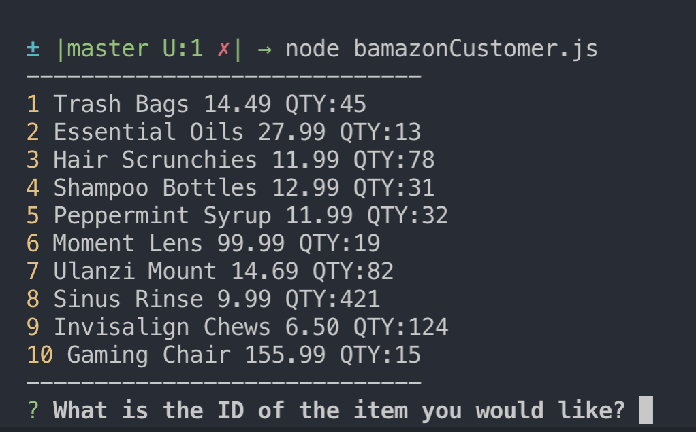
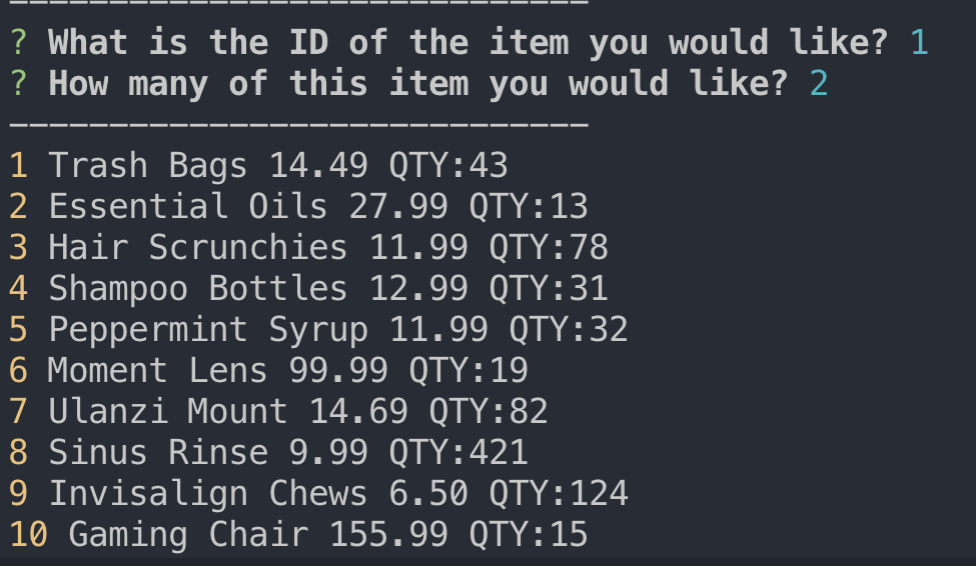
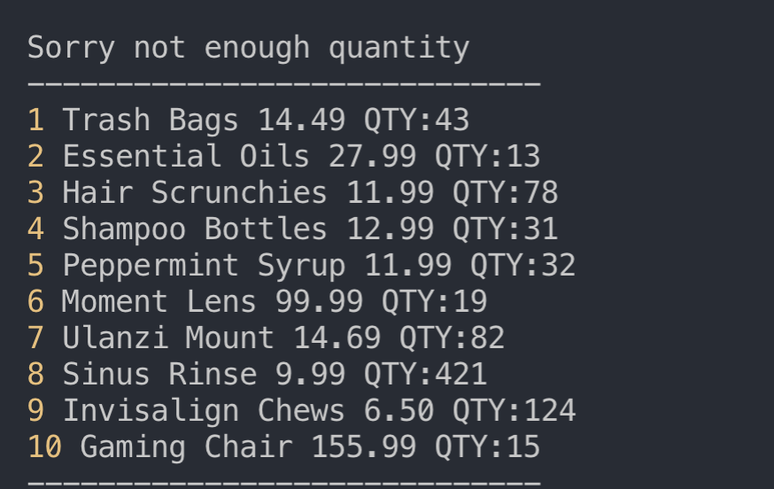

# Bamazon Customer
the customer will be prompted to select which product they want from a menu of options. They will select the product bu ID and the will be prompted to select a quantity.

the quantity will be updated in the database and the user will be prompted to purchase again

If the user attempts to purchase more than the available quantity they will be allerted that that quantity is not available and they need to try again.
